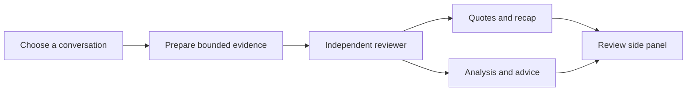

# DSH Review Mode

**An independent second look at your AI conversations.**


**Actively under development / 正在开发中.** This is an experimental community plugin for [DeepSeek Harness](https://github.com/deepseek-ai/deepseek-harness), with support for reading local Codex conversations. It is not an official DeepSeek or OpenAI product. The internal package version `2.1.0` identifies the tested development snapshot, not a stable release.

Version 2.1.0 was exercised through ten user-facing edit/restart/test cycles plus five regression rounds on macOS. It shows concise, expandable insights, isolates review output from the main assistant context, restores the selected target after restart, and lets the new-result notice open the latest review. See [the current implementation contract](CURRENT-IMPLEMENTATION.md) and [iteration evidence](ITERATIONS.md). Model judgments still require human checking.

[中文说明](README.zh-CN.md) · [Installation](docs/INSTALLATION.md) · [Configuration](docs/CONFIGURATION.md) · [Architecture](docs/ARCHITECTURE.md) · [Roadmap](docs/ROADMAP.md) · [Report a bug](https://github.com/hqa-shu/dsh-review-mode/issues/new/choose)

## Why build this?

An AI conversation can keep moving while the original goal gets lost. A confident answer can hide missing evidence. A user can spend an entire session refining a small detail that does not advance the task.

Review Mode explores a separate reviewer that reads a bounded evidence package and gives concrete feedback in a side panel. It considers **goal drift, excessive focus on a detail, and the reasoning behind choices**, with three perspectives: the user's instructions, the whole conversation, and the AI's responses.

## What is in this prototype?

| Capability | Current implementation |
| --- | --- |
| Conversation selection | Current DSH session, another local DSH session, or a local Codex conversation |
| Independent review | A separate subagent receives prepared evidence instead of inheriting the full parent context |
| Side-panel output | Quotes, a recap, case-specific analysis, and concrete advice |
| Automatic monitoring | A selected conversation is checked for new user messages; polling is separate from model review |
| Evidence budgeting | Prioritized sections, length limits, and explicit notices when evidence is omitted |
| Observable state | Empty, reviewing, failed, and ready states; runtime identity and liveness diagnostics |
| Review discipline | Reviewer tool access is disabled; feedback distinguishes user decisions from agent actions |

These are implemented mechanisms, not a claim of proven review accuracy or production reliability. See [validation limits](docs/VALIDATION.md).

## A small example

*Synthetic illustration — not a captured model result.*

> **Request:** “Compare two approaches and show the trade-off.”  
> **AI response:** Recommends one approach without presenting the comparison.  
> **Review:** The requested comparison is missing. Ask for one shared criterion, evidence for each approach, and a clear account of what remains uncertain.



## Try the development snapshot

The initial baseline is **DeepSeek Harness Desktop 0.2.0-rc.2 on macOS arm64**, and **Node.js 24+** for the development scripts. Other platforms and newer Harness versions need validation.

```sh
git clone https://github.com/hqa-shu/dsh-review-mode.git
cd dsh-review-mode
node scripts/prepare-runtime.mjs
node scripts/check.mjs
node scripts/run-tests.mjs
```

The preparation script reads selected SDK packages from your installed Harness application into this checkout's ignored `node_modules/`. It does not change the application or your profile. For another installation path, pass `--asar /absolute/path/to/app.asar`. The public repository contains this plugin's source, not a copy of the host SDK.

Next, install the checkout's **absolute directory path** using Harness's **Plugins** page. Restart Harness, create a session with **审核模式**, and choose a target in the review panel. Follow the [complete installation guide](docs/INSTALLATION.md), especially the model-processing notice. A clean-clone installation in another user's environment has not yet been verified.

## Privacy and model processing

**Local log access does not mean local-only inference.** The host reads conversation evidence from local DSH/Codex records and passes the selected evidence to a reviewer using the configured model provider. If that provider runs remotely, the evidence leaves your machine.

The reviewer has no tools, but the host plugin reads local files and writes caches, diagnostics, and review state. Automatic secret redaction is **not guaranteed**. Use non-sensitive test conversations first; see [data handling](docs/PRIVACY.md).

## Project layout

| File | Purpose |
| --- | --- |
| `index.js` | Host engine, projection, review dispatch, monitoring and diagnostics |
| `reviewer.js` | Conversation discovery, evidence preparation, shared target state and tools |
| `client.js` | Review panel, target selection and state rendering |
| `remote.js` | Target/query helpers plus retained legacy remote-service code |
| `rubric.js` | Review rubric, output structure, parsing and advice routing |
| `cordis.patch.yml` | Harness preset and host-plugin declarations |
| `test/` | Existing regression tests, including synthetic host and UI doubles |
| `scripts/` | SDK preparation, checks and isolated test runner |
| `examples/` | Profile and configuration examples without credentials |

## Help shape the next version

Useful contributions include reproducible UI bugs, evidence-handling edge cases, compatibility reports, and synthetic examples where review advice helps or fails. Start with [CONTRIBUTING.md](CONTRIBUTING.md). Please remove private conversation content from reports.

Planned work includes a cleaner installation path, broader compatibility checks, stronger data minimization, review-quality evaluation, and more polished onboarding. [Track the roadmap](docs/ROADMAP.md).

Built by [Qian'an Huang](https://github.com/hqa-shu), exploring practical AI agents, evaluation, and human–AI collaboration.

## Licensing

No license has been selected for this initial snapshot. Public visibility does not grant a general redistribution license. The Harness SDK remains subject to its own upstream licenses and is not distributed here.
