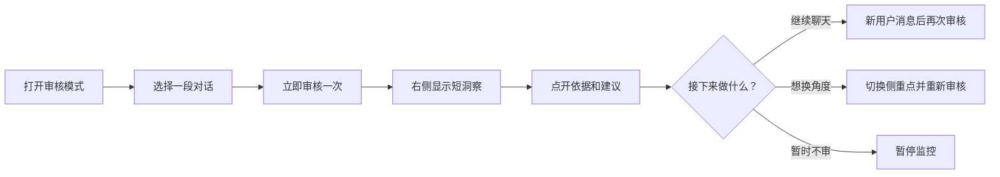
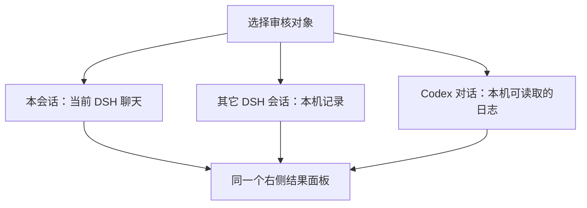
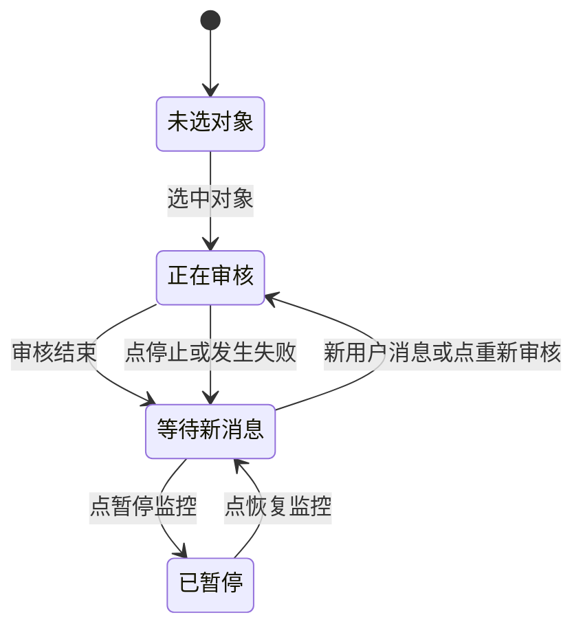
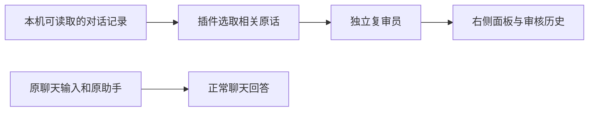

# DeepSeek Harness「审核模式」——简明 SPEC

> 版本：2.1.0 · 更新：2026 年 10 月 4 日
>
> 这份 SPEC 用来回答三件事：用户怎样使用、产品现在会怎样做、怎样判断它做对了。它描述的是**当前已实现版本**；尚未做好的地方在文末单列。

## 一句话说明

**审核模式像坐在旁边的第二位读者。** 你选一段对话，它读你和 AI 已经说过的话，指出有证据支持的问题，并给出下一步建议。评价出现在右侧；原来的聊天仍可继续。

上图是用户能感受到的主流程。“新消息后再次审核”不是每次心跳都调用一次模型；本会话会等原助手这一轮结束再审。

## 你会在界面上看到什么

| 位置 | 它的用途 | 你可以做的事 |
| --- | --- | --- |
| 原来的聊天区 | 继续与原 AI 对话 | 照常输入、发送和看回答 |
| 右侧审核面板顶部 | 显示当前审核对象和状态 | 返回、重新审核、停止正在生成的审核 |
| 「审我 / 审对话 / 审 AI」 | 选择本次评价的侧重点 | 切换后点「重新审核」看新角度 |
| 洞察列表 | 先看通常 2～4 条短结论 | 点一条，在原处展开依据、解释和建议 |
| 历史评价与提问框 | 回看旧结果，追问已有评价 | 选中一条再问“第一条依据是什么？” |
| 新结果提示 | 告诉你有新评价及最新要点 | 点「查看」直达最新评价，提示随后消失 |

**三个侧重点只决定“重点看哪里”，不是三份固定表格。**

| 按钮 | 主要看什么 | 例子 |
| --- | --- | --- |
| 审我 | 你的目标、限制条件和选择 | 我说要复习 Python，后续问题有没有围绕它？ |
| 审对话 | 双方往返是否推动了任务 | 对话是否从“做题”滑到反复挑模板？ |
| 审 AI | 对面 AI 有没有按要求回答 | 用户说 Python，它却加上了“数学题”。 |

## 一条评价长什么样

先给短标题。点开后，应该能看到**依据 → 判断 → 下一步**，而不是只说“你跑偏了”。

| 示例字段 | 合成示例 |
| --- | --- |
| 短标题 | 把 Python 题说成数学题 |
| 依据 | 用户说“30 分钟 Python 复习”；AI 回答“数学题一道没做” |
| 为什么值得注意 | “数学题”没有来自用户提供的材料，可能误导后续计划 |
| 建议与验收 | 请 AI 重新概述；检查它是否只使用已给出的科目和进度 |

这个例子来自**合成测试场景**，不是对真实用户学习状态的评价。证据只能证明 AI 加入了未经支持的“数学题”；若它后来只按要求回复“收到”，就**不能据此断言**它已经改正或仍在犯同一个错。资料只支持一条洞察时，给一条即可，不为凑数拆成四条。

审核员还要遵守这些简单规则：

1. 引用真实原话；把看到的事实与自己的推断分开。
2. 建议要针对这条问题，说明下一步做什么、怎样验收。
3. 用户要求“只回收到”是测试条件；不能建议用户放宽条件来替 AI 的越界回答开脱。
4. 看不到证据就说“不确定”，不要编造文件、工具行为或长期习惯。

## 它能审哪些对话

| 情况 | 当前行为 |
| --- | --- |
| 还没选对象 | 等你选择；不会擅自抓最近一段 Codex 对话来审 |
| 刚选对象 | 立即开始一次审核，并显示正在进行的状态 |
| 对象有新用户消息 | 监控发现后再审；本会话等待原助手回合结束 |
| 点「暂停监控」 | 暂停自动触发，已有结果仍可看 |
| 点「重新审核」 | 就当前对象与侧重点主动再审一次 |
| 完全退出并重启 Harness | 本机恢复已选对象、侧重点和暂停状态；恢复本身不调用模型 |

这里的“Codex 对话”指**本机有可读日志的对话**，不代表所有云端 ChatGPT 聊天都能看到。

## 什么时候会有新结果

失败时要显示可理解的错误状态；不能让加载动画一直转，也不能把“通道已连接”冒充“审核已成功”。同时切换对象或重复点击时，旧结果不能盖掉新目标的结果。

## 数据会走到哪里

两条路线分开：**2.1.0 新生成的审核结果不会作为新问题自动塞给原助手**。旧版本已经写进聊天记录的审核文字不会被自动清除。复审员没有工具权限，不能替你改文件或执行建议。选中的对话证据会交给负责生成评价的 AI 服务；如果它是远程服务，证据会离开本机。插件目前**不保证自动去除敏感信息**，所以选择审核对象前要先确认内容适合发送给该服务。

## 怎样验收这个版本

下面的“通过”指**用户实际能观察到的行为**，不只看代码是否有按钮。

| 场景 | 应看到的结果 |
| --- | --- |
| 打开审核模式但不选对象 | 面板等待选择，没有无关的自动审核 |
| 选择本会话 | 立即出现审核进行状态，随后看到有依据的短洞察 |
| 点开洞察 | 依据、解释和建议在这条下面展开 |
| 选旧评价并追问第一条 | 回答引用选中的那一条，不跳到最新评价 |
| 新评价产生后点提示 | 直接看到最新卡片，未读提示消失 |
| 点停止或快速换对象 | 旧任务停止或被取代，迟到结果不覆盖当前目标 |
| 暂停、退出、再启动 | 目标和暂停状态恢复，不因恢复而额外派审 |
| 在原聊天继续问简单问题 | 原助手照常回答，审核文字不混进答复 |
| 证据不足 | 明说未验证；不把“只回收到”说成纠错失败 |

本机已经进行 **10 轮体验迭代与 5 轮额外回归修复**。当前可移植契约测试为 **20 个脚本、269 条断言通过**；宿主 SDK 测试为 **2 个脚本、37 条断言通过**。真实界面也做过退出、重启、点按和合成对话复测。测试说明的是这些场景，**不保证模型以后每条洞察都准确**。

## 现在还不能保证什么

| 限制 | 对用户意味着什么 |
| --- | --- |
| 模型判断仍会有误 | 对重要结论，展开原话亲自核对；尤其注意“没证据却下结论” |
| 外部 DSH/Codex 对话可能在对面 AI 答完前被发现 | 某次审核可能只有用户新消息，还没有完整回答 |
| 很长的 Codex 日志只取尾部窗口 | 较早的信息可能未进入这次审核，需要看“证据不足”的提示 |
| 其它电脑、系统或新版 Harness 未完成干净安装验收 | 本机通过不等于所有环境都能直接运行 |

后续改进优先级：让外部对话尽量等到 AI 回答完成再审；让模型更稳地遵守证据边界；在另一台干净机器上验证安装与长时间监控。以上是**待做工作**，不是本版已经提供的能力。

## 给开发者的最短索引

| 想改什么 | 看哪里 |
| --- | --- |
| 审核判断与输出文字 | `rubric.js` |
| 选对象、自动触发、任务取消与结果保存 | `index.js`、`reviewer.js` |
| 面板按钮、洞察和提示 | `client.js` |
| 当前实现和边界 | `CURRENT-IMPLEMENTATION.md` |
| 十轮及额外回归的观察 | `ITERATIONS.md` |
| 可重复运行的检查 | `npm test`；准备本机 SDK 后运行 `npm run test:host` |

需要更细的旧版技术背景时，可看 `docs/SPEC-1.2-ARCHIVE.md`；那是**历史草案**，其中的旧版本号、旧现状和待办清单不能当作本版事实。
